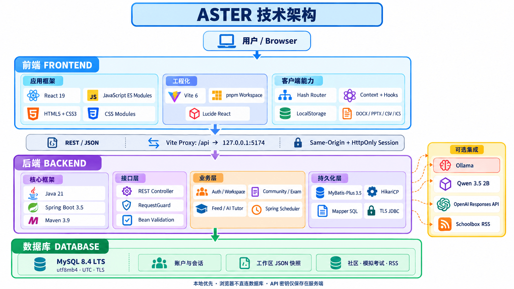

[English](README.md) | [Deutsch](README.de.md) | [简体中文](README.zh-CN.md) | [Español](README.es.md) | [Français](README.fr.md) | [Português](README.pt.md) | [Italiano](README.it.md) | [日本語](README.ja.md) | [한국어](README.ko.md) | [العربية](README.ar.md)

# Aster

Aster is a local learning workspace for secondary-school, Cambridge IGCSE, and IB students. It brings revision, planning, reading, writing, school information, and an optional AI study companion into one interface.

The project is organized into **`front-end`**, **`back-end`**, and **`database`**. The frontend remains React + JavaScript + HTML + CSS. The API is implemented in **Java + Spring Boot + Maven + MyBatis Plus**, backed by **MySQL**.

> **Project status:** functional local development preview. Email/SMS verification and the €4.99/month Pro membership are clearly labelled previews; no delivery or payment provider is connected. Publishing this repository does not deploy a public website.

## Quick links

- [Getting started](#getting-started-windows)
- [Technical architecture](#technical-architecture)
- [Project structure](#project-structure)
- [Features](#features)
- [Development commands](#development-commands)
- [Backend API](#backend-api)
- [Data and privacy](#data-and-privacy)
- [Testing](#testing)
- [Troubleshooting](#troubleshooting)
- [Backend guide](back-end/README.md)
- [Database setup and backup guide](database/README.md)
- [Frontend guide](front-end/README.md)
- [Asset and book credits](front-end/ASSETS.md)

## Technical architecture



## Technology

| Layer | Technology |
| --- | --- |
| Frontend | React 19, JavaScript ES modules, HTML, CSS Modules, Lucide icons |
| Frontend tooling | Vite 6, pnpm workspace; Node.js 22.12+ |
| Exports | `docx` and `pptxgenjs` for editable Word and PowerPoint files |
| Backend | Java 21, Spring Boot 3.5.16, Maven 3.9.16 |
| Persistence | MyBatis Plus 3.5.17, MySQL Connector/J, HikariCP |
| Database | MySQL Community Server 8.4.11 LTS, UTF-8, UTC database sessions |
| Local AI, optional | Ollama 0.34.2 and Qwen 3.5 2B |
| Cloud AI, optional | Server-side OpenAI integration; disabled until explicitly configured |
| Tests | Node's built-in test runner, JUnit 5, Spring MockMvc, real MySQL integration tests |

The frontend dependency versions remain pinned by the root `pnpm-lock.yaml`. Java dependency versions are managed in [back-end/pom.xml](back-end/pom.xml). Node is used for frontend development and launcher scripts; there is no Node API server.

## Project structure

```text
Aster/
├── front-end/
│   ├── src/                 React pages, components, state, course data and tests
│   ├── public/              Images, icons and locally readable book editions
│   ├── qa-fixtures/         Synthetic examples for manual recovery checks
│   ├── index.html
│   ├── vite.config.mjs
│   ├── package.json
│   └── ASSETS.md
├── back-end/
│   ├── src/main/java/com/aster/
│   │   ├── api/             REST controllers and safe error responses
│   │   ├── config/          Private settings, TLS database setup, request guard
│   │   ├── persistence/     MyBatis Plus entities and parameterized mappers
│   │   ├── security/        Password compatibility and request rate limits
│   │   ├── service/         Accounts, community, exams, feeds and AI services
│   │   └── util/            JSON utilities
│   ├── src/main/resources/  Application settings and shared catalogue snapshots
│   ├── src/test/java/       Java regression and MySQL integration tests
│   ├── install-tools.ps1    Checksum-verified JDK/Maven installation
│   ├── maven.ps1
│   ├── mvnw.cmd             Windows convenience launcher for local Maven
│   └── pom.xml
├── database/
│   ├── 001_schema.sql … 007_onboarding.sql
│   ├── download_mysql.py
│   ├── setup_mysql.py
│   ├── migrate.py
│   ├── manage.ps1
│   └── smoke_test.py
├── scripts/                 Development, startup and content-maintenance tools
├── docs/                    AI configuration and product implementation notes
├── Start-Aster.cmd          One-click Windows launcher
├── Start-Aster.ps1          PowerShell entry point to the same launcher
├── package.json             Frontend workspace and convenience commands
└── pnpm-lock.yaml
```

Build output (`front-end/dist`, `back-end/target`), downloaded packages, local working files, credentials, database files, and backups are excluded from source control.

## Getting started (Windows)

The supplied installation and one-click launch scripts target Windows x64. The React and Java applications themselves use standard tooling; other operating systems need their own MySQL/JDK setup and equivalent private configuration.

### 1. Clone and install frontend dependencies

Install Git, Node.js 22.12 or later, and Python 3.11 or later. Install pnpm if it is not already available, then:

```powershell
git clone https://github.com/Antontianhe/Aster.git
cd Aster
pnpm install --frozen-lockfile
```

`npm install` is also supported through npm workspaces. The committed reproducible frontend lockfile is for pnpm.

### 2. Install Java and Maven

```powershell
powershell -NoProfile -ExecutionPolicy Bypass -File .\back-end\install-tools.ps1
.\back-end\mvnw.cmd -v
```

This installs Eclipse Temurin JDK 21 and Apache Maven under `%LOCALAPPDATA%\Aster\toolchains`, verifies the official archive checksums, and records their paths in a local manifest. It does not change the system PATH or saved PowerShell execution policy. The process-level execution option applies only to the project script being run.

Maven downloads the dependencies declared in `pom.xml` on the first build. Its local repository is `%LOCALAPPDATA%\Aster\maven-repository`.

### 3. Install and initialize MySQL

For a **new installation**:

```powershell
py -3 database/download_mysql.py
py -3 database/setup_mysql.py
```

The installer creates an isolated MySQL instance and applies the SQL migrations. It generates private credentials and refuses to overwrite an initialized data directory or replace a server already using port 3306.

For an **existing Aster installation**, keep the current instance and its credentials. Start it and apply any missing migrations:

```powershell
.\database\manage.ps1 -Action Start
py -3 database/migrate.py
```

Schema/setup files live in `database/`; live database files stay outside the repository and OneDrive. See the [database guide](database/README.md) before configuring an existing non-Aster MySQL server.

### 4. Build and start

```powershell
pnpm build:backend
.\Start-Aster.cmd
```

The launcher checks the frontend, MySQL, Spring Boot API, and optional local AI. It starts missing services in hidden windows and opens:

**[http://127.0.0.1:5173/](http://127.0.0.1:5173/)**

Run the launcher again after restarting the computer. `Start-Aster.cmd --no-browser` starts/checks services without opening a tab. The Java package is rebuilt when backend source or resources are newer than the existing JAR.

| Local service | Address |
| --- | --- |
| React development app | `http://127.0.0.1:5173/` |
| Spring Boot API | `http://127.0.0.1:5174/api` |
| API health | `http://127.0.0.1:5174/api/health` |
| MySQL | `127.0.0.1:3306` |
| Ollama, optional | `http://127.0.0.1:11434` |
| Production frontend preview | `http://127.0.0.1:4173/` |

These services bind to this computer. They are not exposed to the internet or school network.

### 5. Optional AI setup

```powershell
py -3 scripts/install-local-ai.py
```

This downloads Ollama and a multi-gigabyte local model. The rest of the app can run without it; AI chat and image-based exam analysis require a ready model. Some supported algebra practice uses the checked question bank without a model request.

The Qwen integration calls a real **local Ollama HTTP API**, not Alibaba Cloud's hosted Qwen service. To obtain a hosted Qwen API key, use [Alibaba Cloud Model Studio's official key guide](https://www.alibabacloud.com/help/en/model-studio/get-api-key). A hosted Qwen provider is not wired into this preview yet; do not put that key in the frontend or assume it can replace the OpenAI configuration below.

An optional cloud provider can be configured separately; see [the OpenAI setup guide](docs/openai-setup.md). Configure `OPENAI_API_KEY` and `ASTER_OPENAI_ENABLED=true` only in the private server environment or its private `app.env` file. Selecting cloud AI requires a content-sharing confirmation. No live paid cloud request is required by the tests.

## Development commands

Run these from the repository root:

| Command | Purpose |
| --- | --- |
| `pnpm dev` | Start the React/Vite development server |
| `pnpm server` | Build if needed, then run the Spring Boot backend |
| `pnpm build` | Build the frontend into `front-end/dist/` |
| `pnpm preview` | Preview the frontend production build on port 4173 |
| `pnpm build:backend` | Package `back-end/target/aster-backend.jar` |
| `pnpm test` | Run frontend unit checks |
| `pnpm test:backend` | Run Java unit checks; database tests are opt-in |
| `pnpm catalogue:export` | Refresh Java's course/question catalogue from frontend source data |

The same scripts work with `npm run <name>`; use `npm test` for frontend tests. MySQL must be running before starting the Java API.

For direct Maven use:

```powershell
.\back-end\mvnw.cmd test
.\back-end\mvnw.cmd package
```

`mvnw.cmd` is a project convenience script using the locally installed Maven distribution, rather than the standard Maven Wrapper JAR. If Java and Maven are already on PATH, `mvn -f back-end/pom.xml package` also works.

After editing shared course data, run `pnpm catalogue:export` and rebuild the backend. The committed catalogue lets the Java service run independently of Node and the frontend source tree.

## Features

### Daily workspace and organization

- Home dashboard with priorities, deadlines, school information, and an open-ended focus stopwatch.
- Homework, a task board, checklists, time estimates, calendar views, and Berlin-aware date handling.
- Resume recent notes, essays, presentations, and study work.
- Backup export, selective import with conflict handling, import receipts, and reversible recovery.
- English, German, and Simplified Chinese interface options; source texts retain their original language.
- Colorful Aurora and mature Studio appearances, light/dark themes, accent choices, sound and reduced-motion settings.

### Revision and examination practice

- Thirteen school subject hubs and a substantial original/classroom-review question bank.
- IGCSE and IB subject pathways with foundation guides, worked examples, confidence checks, and official syllabus links.
- Retrieval practice, flashcards, a knowledge map, teach-back, mistake repair, exam challenges, and interactive topic activities.
- A revision queue, practice/focus targets, answer-history charts, confidence analysis, and CSV exports.
- Mock exams from selected course topics or a student's own question-and-answer study list. Account plans prepare the day before the selected date while the backend runs; missed preparation catches up on restart.
- Objective marking, written model responses and self-review criteria, saved drafts, and first-submission protection.
- Source-linked official past-paper collections, solutions, competitions, and topic-related videos.
- Exam Coach accepts pasted text or page images, asks students to confirm the transcription and focus areas, and offers targeted practice. AI output can be wrong; deterministic checks cover only supported simple equations.

These resources are not a claim of complete coverage of every syllabus, examination option, or exam year. Mock papers and original questions are not official examination papers.

### Reading, writing, and creativity

- Searchable library containing only complete books readable inside Aster, with saved shelves, font and spacing controls, passage highlights, annotations, and bookmarks.
- Reading position and notes are saved; edition credits are retained in local files and [ASSETS.md](front-end/ASSETS.md).
- Original secondary/IGCSE-style English reading-comprehension activities.
- Essay and presentation workspace with editable DOCX/PPTX exports.
- Study notebook with recall prompts, personal summaries, search, archiving, and Markdown export.
- Research desk with internal resource search and outbound Google, Scholar, and YouTube searches.

### Community and motivation

- Four signed-in discussion rooms with replies, own-message editing, reversible removal, reports, and visible-page refresh.
- Ten customizable companion designs, one adopted Buddy, clothes/accessories, and a shared learning-coin balance.
- Keyboard/touch arcade games, 2048, Sudoku, and deck-based educational games.
- Predictable practice rewards, milestones, progress, and optional personal targets.

### School information and accounts

- Username/password accounts, expiring sessions, account-separated workspace synchronization, and optional owner insights.
- Grade entries/CSV imports with comparisons within compatible grading scales.
- A private local Schoolbox timetable, enrolled-course resource catalogue, Veracross calendar and assessment snapshot. Today shows actual dated classes; Planner combines lessons, events, exams and dated revision plans. Confirmed school closures suppress regular lessons.
- Private Schoolbox news RSS connections encrypted in MySQL and checked every 60 seconds while the service runs. Only posts included in that feed update automatically.

## Backend API

Vite forwards `/api` requests to Spring Boot on port 5174, preserving same-origin browser requests. The frontend never reads database credentials or connects directly to MySQL.

| Endpoint | Purpose | Account required |
| --- | --- | --- |
| `GET /api/health` | MySQL connectivity and backend identity | No |
| `GET /api/auth/session` | Current session or `user: null` | No |
| `POST /api/auth/register` | Create account and preview verification challenge | No |
| `POST /api/auth/verify-preview` | Check the displayed local verification code | No |
| `POST /api/auth/login`, `/api/auth/logout` | Password session management | Login: no |
| `GET/PUT /api/workspace` | Account-specific workspace snapshot | Yes |
| `GET/PUT /api/portal` | Account-specific imported portal records | Yes |
| `GET/PUT /api/account/privacy` | Optional analytics and sharing preferences | Yes |
| `GET /api/owner/insights` | Opt-in learning summaries | Owner role |
| `GET/POST /api/community` | Read/post discussion messages | Yes |
| `PATCH /api/community/{id}` | Edit, remove or restore an owned message | Yes |
| `POST /api/community/{id}/report` | Record a concern | Yes |
| `GET/POST /api/mock-exams` | List/create exam plans | Yes |
| `POST /api/mock-exams/{id}` | Generate, submit or remove a plan | Yes |
| `GET/PUT/POST/DELETE /api/school-news` | Status, connect, refresh, disconnect RSS | Yes |
| `GET /api/ai/status` | Local/cloud availability | No |
| `POST /api/ai/chat` | Contextual tutor response | No, local preview |
| `POST /api/exam-coach/{read\|practice}` | Exam reading and targeted practice | No, local preview |

Write requests require an allowed local `Origin`, JSON where applicable, and `X-Aster-Client: workspace`. Request bodies are bounded to 2 MB. Authentication, chat, feeds and AI have request limits. Backend errors are returned as JSON with a user-facing `error` string.

## Data and privacy

- The database contains the existing relational schema plus account, workspace, feed, community, mock-exam and consent tables. SQL migrations are additive and tracked in `schema_migrations`.
- Passwords use salted scrypt. Existing accounts from the previous implementation remain compatible; password material is never sent back to the frontend.
- Sessions use random tokens, with only token hashes stored in MySQL, and `HttpOnly; SameSite=Strict` cookies scoped to `/api`.
- MySQL connections use TLS with the installation's CA certificate. The app database user has only data read/write privileges within `aster`.
- Private RSS links use AES-256-GCM. The Java service retains the existing ciphertext layout and encryption key.
- Credentials, the encryption key, database files, AI models, logs, and backups live under `%LOCALAPPDATA%\Aster`, outside the repository.
- Optional analytics and identifiable progress sharing default off. Owner summaries require an explicitly assigned database role; registration does not grant that role.
- Guest data is browser-local. Signed-in workspace snapshots sync to MySQL. `localhost` and `127.0.0.1` have separate browser storage, so use one address consistently.
- Browser reminders need an open page. Scheduled backend work requires the local Java service to be running.

To make a database backup:

```powershell
.\database\manage.ps1 -Action Backup
```

The backup is written into the private installation's `mysql-instance/backups/` directory. Browser workspace exports and database backups cover different data; a browser export does not include server-held accounts, chat, or private feed configuration.

## Testing

The migration was checked with **72 frontend tests** and **21 Java tests**, including **6 real-MySQL integration tests**. Integration tests exercise the actual schema over TLS and roll their writes back. They do not require or modify a real student's account.

```powershell
pnpm test
pnpm build
pnpm test:backend

# Opt in to real MySQL checks after starting the database:
$env:ASTER_INTEGRATION_TESTS = 'true'
pnpm test:backend
Remove-Item Env:ASTER_INTEGRATION_TESTS
```

Coverage includes password/hash and encrypted-feed compatibility, preview verification, cookies and origin checks, account isolation, privacy/owner permissions, message ownership and retries, mock preparation and marking, AI provider consent, feed restrictions, and checked algebra questions. AI provider responses are simulated for deterministic unit tests; a paid cloud call is not part of validation.

The packaged Java service is also checked over HTTP. Frontend production output and a Java executable JAR are built separately.

## Troubleshooting

| Symptom | Check |
| --- | --- |
| The local link does not open | Run `Start-Aster.cmd`; leave the launched services running. |
| Accounts or saved data are unavailable | Check `/api/health`, then `database/manage.ps1 -Action Status`. |
| A build cannot find Java or Maven | Rerun `back-end/install-tools.ps1`, then use `back-end/mvnw.cmd`. |
| PowerShell blocks a script | Use the `.cmd` launcher, which permits only its child setup process; saved policy is unchanged. |
| MySQL port 3306 is occupied | Identify the existing server; the installer deliberately refuses to overwrite it. |
| MySQL credentials or CA cannot be read | Run as the Windows user who installed Aster; the private directory has restricted permissions. |
| AI is unavailable | Install/start Ollama and confirm the local model is downloaded. Other features remain usable. |
| Data seems different in another tab | Confirm that both tabs use the same host (`127.0.0.1` versus `localhost`) and account. |
| School updates appear stale | The Java service must be running, the private RSS link valid, and the post included in that feed. |

Local service logs are written under `%LOCALAPPDATA%\Aster`, including `frontend.out.log`, `api.out.log`, and their error logs. Avoid publishing those logs because they may contain local operational information.

## Current limitations

- Verification is a local preview, not proof of email/phone ownership. There is no password-recovery delivery service.
- Pro is a UI preview, not a billed subscription or secure commercial entitlement. Coins and imported grades are not a fraud-resistant payment system.
- The site is not hosted publicly. HTTPS, production authentication/cookies, deployment configuration, moderation operations, and payment/email providers require separate production work.
- School resources and assessment topics refresh through a scheduled, signed-in browser import, not a continuous Veracross API. Permission-denied pages and unpublished guides remain unavailable. RSS updates only its news feed; grades remain separate imported/manual records.
- The small local AI model does not reproduce ChatGPT's full capabilities. Optional cloud requests require separate API access, billing, and consent.
- Book availability and reuse rights vary by edition. Preserve source notices and distinguish full in-app editions from external resources.
- Existing terms/privacy pages describe a development preview. Operator details, retention, age/guardian handling, and launch-country requirements need finalization before a public student service.

## Credits and contact

Course, competition, paper and book entries link to their sources. See [front-end/ASSETS.md](front-end/ASSETS.md) for illustration and edition credits. Source-specific licenses and public-domain notices remain applicable; this repository does not grant rights to third-party copyrighted books or school materials.

Project contact: [anton.zhang@icloud.com](mailto:anton.zhang@icloud.com)

Useful technical references: [Spring Boot](https://docs.spring.io/spring-boot/3.5/index.html), [MyBatis Plus](https://baomidou.com/en/getting-started/install/), [Apache Maven](https://maven.apache.org/download.cgi), [Eclipse Temurin](https://adoptium.net/), and [MySQL](https://dev.mysql.com/doc/refman/8.4/en/).

### Exam photos and corrections

Open **School & planner → Planner → Exam photos**, or **School → Exam photos**. The legacy `/#/exams?tab=corrections` link remains supported. Upload up to four JPG, PNG, or WebP pages (12 MB per original), use the camera, or paste exam text. The browser resizes images before analysis. Check the transcription and extracted questions against the original page before asking for feedback.

The correction notebook keeps the original answer and teacher comments beside a fresh written attempt. Students can request structured AI feedback, compare a suggested solution, write a reflection, and save their corrections. Changing the source question or new answer clears obsolete feedback. Manual correction and self-review remain available when AI is offline. Saved reviews retain text and working, **not photos**; original photos are available only during the open session. AI feedback is advisory and never changes an official grade or awards an exam-grade bonus.

`POST /api/exam-coach/repair` uses the existing local/cloud provider selection and requires a checked source question plus a new attempt. Optional cloud processing remains off until configured and explicitly selected. The local model is small and can misread handwriting or reasoning; teacher feedback and mark schemes remain the reference. The legacy `/#/exam-coach` link opens the same correction area.

### Profile and avatar

The top-right profile portrait shows the student character and Buddy together. **Customize & settings** contains visual person/monster options, Buddy customization, and existing workspace preferences. **Information** contains private contact, school, and birthday fields; it is not part of the game navigation. Basic character choices are free, and optional extras use the existing shared learning-coin balance.

### Science preview

**Science lab** contains thirteen original interactive experiments, grouped into Chemistry, Biology, Physics and All labs: neutralization, DC circuits, pendulums, osmosis, inheritance, photosynthesis, enzymes, reaction rates, diffusion, buoyancy, refraction, waves and gas compression. Sliders expose assumptions and quantities; the eight newest labs include trial recording and saved investigation notes. Relative biological/kinetic models are explicitly labelled teaching illustrations rather than measured datasets. Animation respects reduced motion. No third-party simulation assets are copied.

Celebration scenery fills the workspace background on every study route, without the former floating island. **Today → Celebrations** can apply any scene across Aster or restore automatic seasonal/festival selection. Festival dates for 2026–2028 use [Hong Kong Observatory calendar tables](https://www.hko.gov.hk/en/gts/time/conversion.htm) to avoid platform-specific lunar calendar differences.

Supported, explicitly worded single-variable linear equations also have a deterministic final-value check. Its feedback is labelled “Value checked” and explicitly does not certify all written reasoning. More complex questions use advisory model feedback. Validation includes the frontend test suite, backend rules, transactional MySQL tests, and a live photo → extracted question → rewritten answer → saved review browser check.

### Speaking, debate and daily activities

- **Speaking room → Speaking practice** (`/#/oral`): choose English, German, French, Spanish or Mandarin, a level and a topic, including IGCSE speaking and IB Theory of Knowledge discussion. Alex, an animated AI partner, reads actual model replies aloud with selectable device voices and speed. Speech events drive mouth movement and listening/thinking states. Have a two-to-six-turn conversation, then receive transcript-based feedback. Opt-in dictation provides an editable transcript; optional conversation mode sends words after a pause and listens again after the reply. Recording stops after 60 seconds and cleans up on navigation. Unsupported browsers retain typing and text replies. Browser speech recognition/playback can use a provider service independently of local AI; see [MDN Web Speech](https://developer.mozilla.org/en-US/docs/Web/API/Web_Speech_API).
- **Speaking room → Debate** (`/#/debate`): choose a motion and a side, answer the animated AI opponent across three rounds, then write a closing summary. The model evaluates reasoning, evidence, rebuttal and clarity out of five each. Coins equal half the total score, rounded down, capped at **10**; daily boosts do not alter this cap. Feedback summaries are saved, while the live transcript is not persisted.
- **Daily claw** (`/#/claw`): one free daily claim at Europe/Berlin midnight. Four equally likely rewards: a day-long learning-coin multiplier, Starlight skin, headphones, or a crown. An owned cosmetic becomes the multiplier. The reward is saved before the animation runs, preventing a refresh from awarding a second prize. Claw position is cosmetic and the odds are displayed.
- **Number stage** (`/#/math-game`): original multiplication/division game for tables 2–12, ten questions, with an optional 60-second sprint. Keyboard and touch keypad work; results show missed facts for review. Each correct answer earns a coin, up to ten, doubled only if the daily boost is active. No entry fee, purchased chance, cash-out or real-money reward is involved.

`POST /api/conversation/turn` and `/api/conversation/evaluate` use the existing `AiProvider`. They validate supported language, side, turn limits and structured scoring; there are no canned AI fallback replies. Cloud requests still require configuration and explicit sharing consent. The local model is small: claims and feedback remain advisory. Current coin transactions follow Aster's existing local workspace economy, not a tamper-resistant public competition ledger.

The avatar editor remains available free through **Profile → Customize & settings**: body, person/monster type, eyes, hair, clothes and colors, plus coin accessories. Both the avatar and Buddy appear together and can wave, dance and high-five.

### Private school refresh

The local Codex heartbeat **Update school resources and exam practice** runs daily at 07:00, 16:00 and 20:00 Europe/Berlin. The computer and Codex must be running, and the school browser sessions must remain signed in. Failures preserve the last successful snapshot; the site shows check times and missing guides. The private calendar feed refreshes at most every 15 minutes while the local Vite service is running. The UI checks for a new local snapshot every minute and on focus. This private local endpoint is not included in a public build or served to LAN clients.

Browser captures live only in ignored `.work/school-sync/`: `pages.json` contains source text/links; `veracross-assessments.json` includes the observed integer calendar `year`; `veracross-events.json` includes each calendar event's `title`, `url`, `year` and detail `text`. Capture current and upcoming calendar months, including closures. `schoolbox-assessments.json` stores confirmed `assessmentId`, `subject`, `date`, optional `time`, `sourceUrl` and `checkedAt`. Never copy marks or submitted answers into the resource catalogue. Private feed URLs and signed download URLs stay in this ignored directory.

`assessment-guides.json` binds each topic guide to an exact `assessmentId`, or an explicit date/year plus title; a title alone must never carry a guide into the next year's assignment. `documents.json` lists locally downloaded readable originals and source links. Rebuild with `node scripts/import-school-snapshot.mjs`. The importer writes `snapshot.json` atomically; retain existing captures for sources that are temporarily unavailable. The local plugin serves only manifest-listed document files.

Assessments are separated into upcoming and past using the Berlin school date. Practice contains original questions or clearly marked source-guided prompts, and never substitutes an older guide for an unpublished future assessment. Revision plans end before the earliest conflicting deadline. Conflicts between Schoolbox and Veracross show both dates and a teacher-confirmation notice; neither source is silently discarded.

**Learn** contains My subjects, IGCSE & IB, and Study roadmap. Each subject contains its learning path, quick review, revision tools, resources, topic maps and assessment practice; English practice belongs to English. Competitions combines training with an internal reader for 133 verified official past-paper PDFs, while the book library lists only full readable local editions.

### Immersive book reader

Opening a local book fills the app viewport with an independent paper, sepia or night reading room. Layered paper, a spine shadow, and reversible 3D page turns replace the old dashboard backdrop. Use **Left/Right arrows** to turn pages, **Home/End** to reach the first/last page, **F** for browser fullscreen, or swipe horizontally on touch screens. **Escape** closes the reader (the browser may first exit native fullscreen). Native fullscreen requires a user gesture and may be restricted by an embedded browser; the reader still fills the app viewport.

Shortcuts do not interrupt typing or text selections. Existing chapter navigation, bookmarks, highlights, notes, and reading progress are preserved. System/app reduced-motion preferences disable page-turn motion. The reader's pages are digital reading chunks, not printed edition page numbers.
